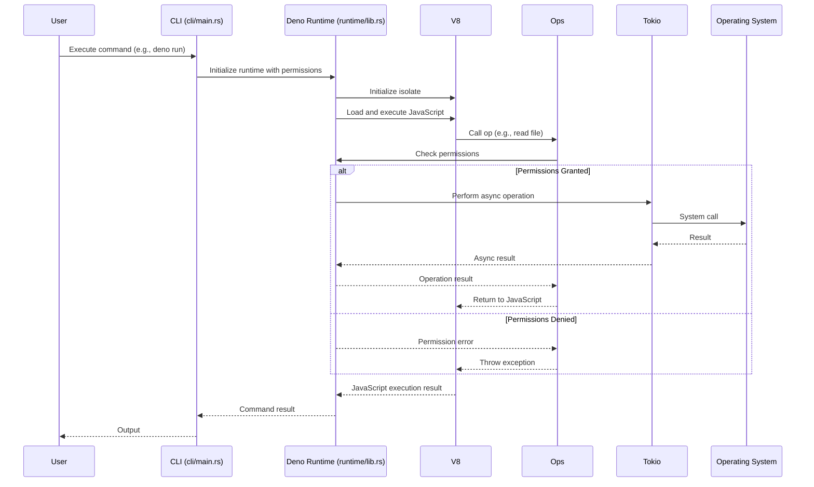

# Deno Architecture

## Purpose
This node provides a detailed explanation of Deno's technical architecture, including its key components, structure, and how different parts of the system interact.

## Classification
- **Domain:** Backend
- **Stability:** Semi-stable
- **Abstraction:** Structural
- **Confidence:** Established

## Content

### High-Level Architecture

Deno's architecture is built around several key components that work together to provide a secure and efficient runtime for JavaScript and TypeScript. The core architecture can be visualized as layers, starting from the user interaction through the CLI, down to the core runtime and the underlying system.

```mermaid
graph TD
    A[User]
    B[CLI Entry Point<br/>(cli/main.rs)]
    C[Deno CLI Crate]
    D[Deno Runtime Crate<br/>(runtime/lib.rs)]
    E[V8 Engine]
    F[Tokio Async Runtime]
    G[Operating System]
    H[Ops Calls]

    A --> B
    B --> C
    C --> D
    D <--> E
    D <--> F
    D --> G
    E --> H
    H --> D
    F --> D
```

### Key Components

#### CLI (`cli/main.rs`)

The main entry point for the Deno command-line executable. When commands like `deno run`, `deno test`, or `deno fmt` are executed, the processing begins here.

Responsibilities:
- Parsing command-line arguments provided by the user
- Determining which subcommand to execute
- Setting up the necessary environment and configuration
- Dispatching the request to the appropriate logic

Example of simplified argument parsing:

```rust
// cli/main.rs - Example of argument parsing (simplified)
use clap::{Parser, Subcommand};

#[derive(Parser)]
#[clap(name = "deno")]
struct Cli {
    #[clap(subcommand)]
    command: Commands,
}

#[derive(Subcommand)]
enum Commands {
    Run {
        filename: String,
        #[clap(long = "allow-net")]
        allow_net: bool,
    },
    Test,
    // ... other commands
}
```

#### Runtime (`runtime/lib.rs`)

The core library that implements the Deno runtime's fundamental logic in Rust.

Responsibilities:
- Initializing and managing the V8 isolate and context
- Setting up and interacting with the Tokio asynchronous runtime
- Registering and handling "ops" (operations)
- Implementing core Deno APIs
- Managing the event loop

Example of op registration:

```rust
// runtime/lib.rs - Example of op registration (simplified)
use deno_core::op;
use deno_core::Extension;

#[op]
fn op_read_file(path: String) -> Result<String, std::io::Error> {
    std::fs::read_to_string(path)
}

pub fn get_extension() -> Extension {
    Extension::builder()
        .ops(vec![op_read_file::decl()])
        .build()
}
```

#### V8 Engine

Google's open-source JavaScript and WebAssembly engine that executes the user's code.

Responsibilities:
- Parsing and executing JavaScript code
- Managing memory for JavaScript objects
- Optimizing JavaScript execution
- Providing interfaces for Rust code to interact with JavaScript

#### Tokio

An asynchronous runtime for Rust that manages Deno's event loop.

Responsibilities:
- Handling non-blocking I/O operations
- Managing the event loop
- Providing asynchronous primitives like futures and tasks
- Enabling efficient concurrency

#### "Ops" System

The bridge between the JavaScript world and the Rust world.

Responsibilities:
- Providing a way for JavaScript code to call Rust functions
- Enforcing the security model by checking permissions
- Managing data serialization between JavaScript and Rust
- Handling asynchronous operations

### Data Flow



### Project Structure

Deno's source code is organized into several key directories and files:

1. `cli/`: Contains the command-line interface code
   - `cli/main.rs`: Entry point for the Deno executable
   - `cli/args/`: Command-line argument parsing
   - `cli/tools/`: Implementation of commands like `run`, `test`, `fmt`

2. `core/`: Contains the core runtime functionality
   - `core/runtime.rs`: Core runtime implementation
   - `core/ops.rs`: Operations system

3. `runtime/`: Contains the high-level runtime functionality
   - `runtime/lib.rs`: High-level runtime implementation
   - `runtime/ops/`: Implementation of specific operations

4. `ext/`: Contains extensions to the core runtime
   - `ext/web/`: Web platform APIs
   - `ext/fetch/`: Fetch API
   - `ext/fs/`: File system APIs

5. `std/`: Contains the standard library
   - `std/http/`: HTTP server and client
   - `std/fs/`: File system utilities
   - `std/path/`: Path manipulation

### Compilation Process

The Deno binary is built using Cargo, the Rust package manager and build system. The `Cargo.toml` file defines the project's dependencies and build configuration.

Key dependencies include:
- `v8`: The V8 JavaScript engine
- `tokio`: Asynchronous runtime for Rust
- `rusty_v8`: Rust bindings for V8
- `hyper`: HTTP client and server
- `serde`: Serialization and deserialization
- `clap`: Command-line argument parsing

## Relationships
- **Parent Nodes:** 
  - [overview.md] - is-child-of - The parent overview of Deno
- **Child Nodes:** None
- **Related Nodes:** 
  - [security_model.md] - closely-related - Security is a core aspect of Deno's architecture
  - [module_resolution.md] - depends-on - Module resolution relies on the architecture
  - [typescript_compilation.md] - implemented-in - TypeScript compilation is part of the architecture

## Navigation Guidance
- **Access Context:** Use this node when you need to understand Deno's internal structure or how different components interact
- **Common Next Steps:** Explore security_model.md for details on the permission system or module_resolution.md to understand how modules are loaded
- **Related Tasks:** Debugging Deno, contributing to Deno, understanding Deno's internals
- **Update Patterns:** This node should be updated when significant architectural changes occur in Deno

## Metadata
- **Created:** 2025-05-18
- **Last Updated:** 2025-05-18
- **Updated By:** AI Assistant

## Change History
- 2025-05-18: Initial creation based on Deno wiki information
