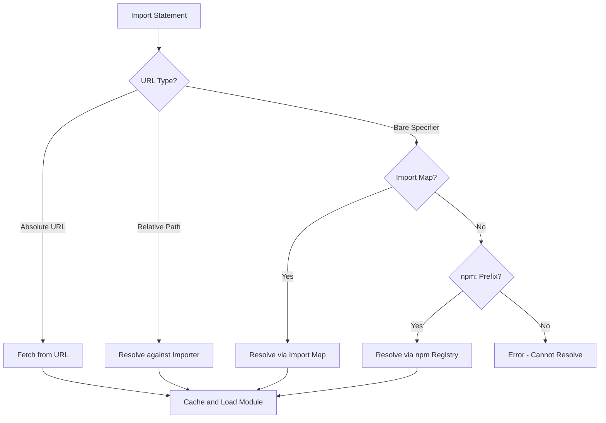

# Deno Module Resolution and Package Management

## Purpose
This node explains how Deno resolves modules and manages packages, covering both Deno-specific modules and npm packages.

## Classification
- **Domain:** Backend
- **Stability:** Semi-stable
- **Abstraction:** Structural
- **Confidence:** Established

## Content

### Overview

Deno's module resolution and package management approach differs significantly from Node.js, emphasizing explicit URLs, caching, and integrated support for both Deno modules and npm packages. This design reflects Deno's focus on web standards, security, and developer ergonomics.

### Module Resolution Process

Deno resolves modules in the following order:

1. **URL Resolution**: Absolute URLs are resolved directly
2. **Deno Registry Resolution**: Modules from the Deno registry
3. **npm Package Resolution**: Packages from the npm registry
4. **Local File Resolution**: Relative and absolute file paths



### URL-Based Imports

Unlike Node.js, which uses the `node_modules` directory and `package.json`, Deno uses URL-based imports for modules. Modules are referenced directly by their URL, which can be a remote URL or a local file path.

```typescript
// Importing from standard library
import { serve } from "https://deno.land/std@0.140.0/http/server.ts";

// Importing from a third-party module
import { parse } from "https://deno.land/x/csv@v0.5.0/mod.ts";

// Importing from a local file
import { hello } from "./hello.ts";
```

This approach offers several advantages:
- **Explicit Dependencies**: All dependencies are explicitly specified in import statements
- **No Dependency Manager**: No need for a separate package manager like npm
- **Deterministic Resolution**: Import resolution is deterministic based on the URL
- **Built-in Versioning**: Versioning is handled as part of the URL

### Caching Mechanism

When Deno downloads a module for the first time, it caches it locally. Subsequent imports of the same module URL will use the cached version, improving performance and allowing offline development.

The cache is stored in the following locations by default:
- **Linux/macOS**: `$HOME/.cache/deno`
- **Windows**: `%LOCALAPPDATA%\deno`

You can override the cache location using the `DENO_DIR` environment variable.

Deno's caching has several key characteristics:
- **Immutable Cache**: Once a module is cached, it is never updated unless explicitly requested
- **Version-Specific**: Different versions of the same module are cached separately
- **Integrity Checking**: Deno verifies the integrity of cached modules using subresource integrity
- **Manual Control**: The cache can be managed with the `deno cache` command

```bash
# Manually cache dependencies
deno cache main.ts

# Reload cached dependencies
deno cache --reload main.ts

# Reload specific dependencies
deno cache --reload=https://deno.land/std@0.140.0 main.ts
```

### Import Maps

Import maps provide a way to control the resolution of bare specifiers, similar to how Node.js resolves packages from `node_modules`.

An import map is a JSON file that maps import specifiers to URLs:

```json
{
  "imports": {
    "lodash": "https://esm.sh/lodash@4.17.21",
    "react": "https://esm.sh/react@17.0.2",
    "components/": "./components/"
  }
}
```

With this import map, you can use these imports in your code:

```typescript
import _ from "lodash";
import React from "react";
import { Button } from "components/button.ts";
```

Import maps are specified using the `--import-map` flag:

```bash
deno run --import-map=import_map.json main.ts
```

They can also be specified in a `deno.json` configuration file.

### npm Integration

As of recent Deno versions, npm package support is built directly into Deno, allowing seamless use of the npm ecosystem. This is handled by the `cli/npm.rs` component.

npm packages can be imported using the `npm:` prefix:

```typescript
import express from "npm:express@4.18.2";
import chalk from "npm:chalk@5.0.1";

const app = express();
app.get("/", (req, res) => {
  res.send(chalk.blue("Hello from Deno!"));
});
app.listen(3000);
```

Behind the scenes, Deno:
1. Fetches the package metadata from the npm registry
2. Downloads the package and its dependencies
3. Caches them locally
4. Creates a compatibility layer for Node.js-specific APIs

### `deps.ts` Pattern

A common pattern in Deno projects is to centralize dependencies in a `deps.ts` file:

```typescript
// deps.ts
export { serve } from "https://deno.land/std@0.140.0/http/server.ts";
export { parse } from "https://deno.land/x/csv@v0.5.0/mod.ts";
export { DB } from "https://deno.land/x/sqlite@v3.4.0/mod.ts";

// main.ts
import { serve, parse, DB } from "./deps.ts";
```

This pattern offers several benefits:
- **Version Management**: Update versions in a single place
- **Import Organization**: Organize imports consistently
- **Faster Performance**: Reduce the number of remote imports
- **Easier Maintenance**: See all dependencies in one place

### Lockfile Support

Deno supports lockfiles to ensure reproducible builds. A lockfile records the exact URL, version, and integrity hash of each dependency.

```bash
# Generate a lockfile
deno cache --lock=lock.json --lock-write main.ts

# Use the lockfile to ensure integrity
deno run --lock=lock.json main.ts
```

If a locked dependency has changed, Deno will error unless the `--lock-write` option is used to update the lockfile.

### Vendoring

For environments where network access is restricted or for better performance, Deno supports vendoring dependencies locally:

```bash
# Download all dependencies to a local vendor directory
deno vendor main.ts
```

This creates a `vendor` directory with all dependencies and an import map to redirect imports to the local files.

### Key Components

Behind the scenes, several key components handle module resolution and package management:

1. **`cli/resolver.rs`**: The central resolver that handles specifier resolution
2. **`cli/npm.rs`**: Manages npm package resolution and installation
3. **`cli/registry.rs`**: Interacts with the Deno registry
4. **`resolvers/deno/lib.rs`**: Resolves Deno-specific module specifiers
5. **`resolvers/npm_installer/lib.rs`**: Installs npm packages

### Configuration with `deno.json`

Module resolution and package management can be configured using a `deno.json` file:

```json
{
  "imports": {
    "lodash": "https://esm.sh/lodash@4.17.21"
  },
  "tasks": {
    "start": "deno run --allow-net main.ts"
  },
  "lint": {
    "files": {
      "include": ["src/"]
    }
  },
  "fmt": {
    "options": {
      "useTabs": true,
      "lineWidth": 80
    }
  },
  "compilerOptions": {
    "strict": true
  }
}
```

## Relationships
- **Parent Nodes:** 
  - [overview.md] - is-child-of - The parent overview of Deno
- **Child Nodes:** None
- **Related Nodes:** 
  - [architecture.md] - depends-on - Module resolution is part of Deno's architecture
  - [best_practices.md] - influences - Module resolution influences best practices
  - [development_workflow.md] - relates-to - Module resolution is a key part of the development workflow

## Navigation Guidance
- **Access Context:** Use this node when you need to understand how Deno resolves modules or manages dependencies
- **Common Next Steps:** Explore best_practices.md for guidelines on managing dependencies effectively or development_workflow.md for broader workflow context
- **Related Tasks:** Setting up a Deno project, managing dependencies, troubleshooting import issues
- **Update Patterns:** This node should be updated when there are changes to Deno's module resolution, import map features, or npm integration

## Metadata
- **Created:** 2025-05-18
- **Last Updated:** 2025-05-18
- **Updated By:** AI Assistant

## Change History
- 2025-05-18: Initial creation based on Deno wiki information and additional research
