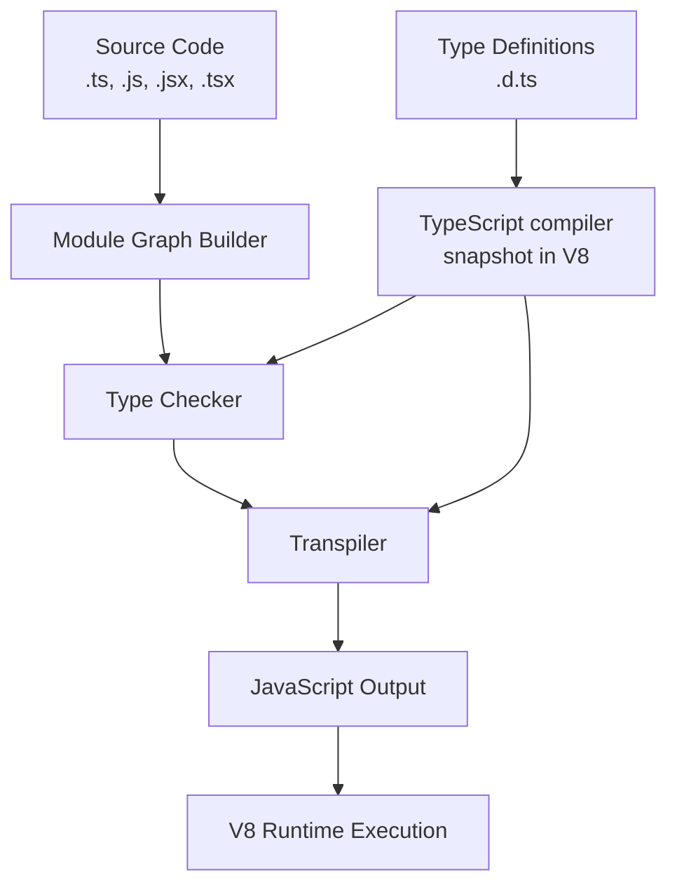
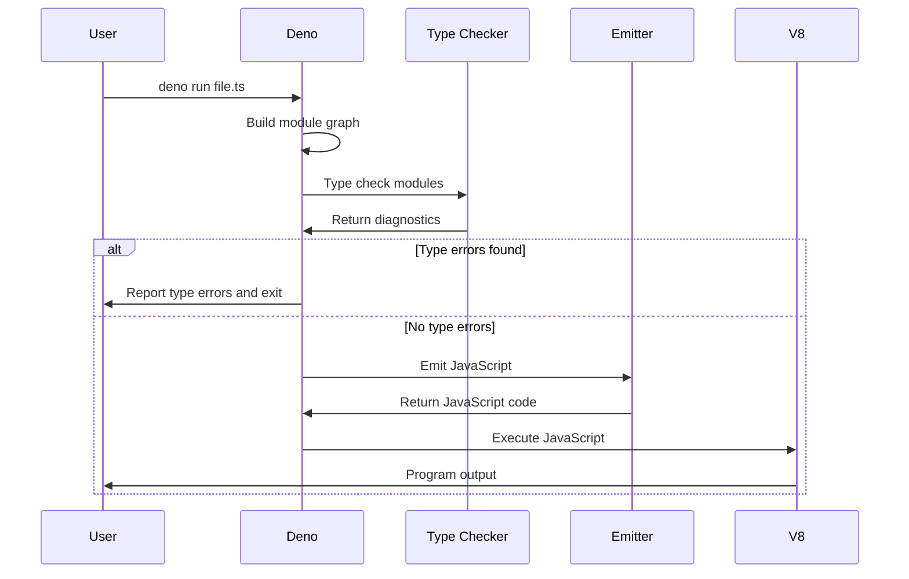

# JavaScript and TypeScript Compilation in Deno

## Purpose
This node explains how Deno handles JavaScript and TypeScript compilation, including type checking, transpilation, and the overall compilation process.

## Classification
- **Domain:** Backend
- **Stability:** Semi-stable
- **Abstraction:** Structural
- **Confidence:** Established

## Content

### Overview

Deno provides first-class support for TypeScript, allowing developers to run TypeScript code directly without a separate compilation step. This feature significantly improves the developer experience by simplifying the workflow while maintaining the benefits of static type checking.

Deno compiles both JavaScript and TypeScript code using an integrated TypeScript compiler. This eliminates the need for external tools like `tsc` and provides a seamless experience for developers.

### Compilation Pipeline



### TypeScript Compiler Snapshot

Deno uses a **TypeScript compiler snapshot** for efficient startup. During the build process of Deno itself:

1. The TypeScript compiler (`cli/tsc/00_typescript.js`) is loaded into a V8 isolate
2. Deno's integration code (`cli/tsc/99_main_compiler.js`) is also loaded
3. Built-in type definitions (`cli/tsc/dts/*.d.ts`) are incorporated
4. This entire environment is snapshotted and embedded in the Deno executable

This snapshotting approach allows for fast initialization of the TypeScript environment when running Deno commands.

### Key Components

Several Rust modules handle the compilation process:

#### `cli/tsc/mod.rs`

This module serves as the interface between Rust and the TypeScript compiler snapshot in V8. It handles:

- Communication with the TypeScript compiler
- Sending compilation and type checking requests
- Receiving diagnostic information and emitted code

#### `cli/type_checker.rs`

The high-level type checking logic lives here. This module:

- Uses `cli/tsc/mod.rs` to communicate with the TypeScript compiler
- Manages module dependencies
- Orchestrates the type checking process
- Reports diagnostic information

This component is used by the `deno check` command and during `deno run` and `deno compile`.

#### `cli/emit.rs`

After type checking, code emission is handled by this module. It uses the TypeScript compiler to:

- Transform TypeScript into JavaScript
- Remove type annotations
- Downlevel modern JavaScript syntax for compatibility
- Generate source maps
- Cache emitted code for performance

#### `runtime/transpile.rs`

This module handles simpler, on-the-fly transpilation within the Deno runtime, separate from the full `cli/tsc` pipeline. It may be used for internal runtime tasks.

### Workflow

When you run a TypeScript file with Deno, the following process occurs:

1. **File Loading**: Deno loads the source file and its dependencies
2. **Module Graph**: Deno builds a module graph representing all dependencies
3. **Type Checking**: The TypeScript compiler checks types if not disabled with `--no-check`
4. **Transpilation**: TypeScript code is transpiled to JavaScript
5. **Execution**: The JavaScript code is executed by the V8 engine



### Type Checking

Deno performs type checking by default when running TypeScript code. This can be controlled with several options:

- **Default behavior**: Type checking is performed
- **`--no-check`**: Skips type checking for faster execution
- **`--check`**: Forces type checking (the default)
- **`deno check`**: Performs type checking without execution

Type checking provides immediate feedback on type errors:

```typescript
// example.ts
function greet(name: string): string {
  return `Hello, ${name}!`;
}

// Type error: Argument of type 'number' is not assignable to parameter of type 'string'
console.log(greet(42));
```

Running this with `deno run example.ts` would produce an error before execution.

### Configuration

TypeScript compilation can be configured using a `deno.json` or `deno.jsonc` file with the `compilerOptions` key:

```json
{
  "compilerOptions": {
    "strict": true,
    "noImplicitAny": true,
    "strictNullChecks": true,
    "target": "ES2020",
    "lib": ["dom", "dom.iterable", "esnext"]
  }
}
```

These options mirror the TypeScript compiler options and allow fine-tuning of the type checking and compilation process.

Alternatively, configuration can be specified using the `tsconfig.json` file:

```json
{
  "compilerOptions": {
    "allowJs": true,
    "checkJs": true,
    "esModuleInterop": true,
    "experimentalDecorators": true,
    "emitDecoratorMetadata": true,
    "isolatedModules": true,
    "jsx": "react",
    "module": "esnext",
    "moduleResolution": "node",
    "noEmit": true,
    "resolveJsonModule": true,
    "sourceMap": true,
    "strict": true,
    "target": "esnext"
  }
}
```

Deno will automatically use a `tsconfig.json` or `jsconfig.json` file if it exists in the project directory.

### JSX/TSX Support

Deno supports JSX in both JavaScript and TypeScript files:

- `.jsx` and `.tsx` files are recognized and processed
- JSX/TSX transforms are applied during compilation
- Different JSX factories can be configured (React, Preact, etc.)

Configuration example:

```json
{
  "compilerOptions": {
    "jsx": "react",
    "jsxFactory": "React.createElement",
    "jsxFragmentFactory": "React.Fragment"
  }
}
```

### Type Declaration Files

Deno automatically includes type declarations for:

- Built-in Deno APIs
- Web APIs that Deno implements
- Third-party modules that provide their own type declarations

For modules without declarations, Deno can generate them:

```bash
deno types https://deno.land/x/module@v1.0.0/mod.js > types.d.ts
```

### Cache Management

Compiled JavaScript is cached to improve performance on subsequent runs. The cache can be managed with:

```bash
# Clear the entire cache
deno cache --reload file.ts

# Clear cache for specific dependencies
deno cache --reload=https://deno.land/std@0.140.0 file.ts
```

### Benchmarking

The TypeScript compilation process is continuously optimized for performance. The `deno bench` command can be used to measure compilation performance:

```bash
deno bench --allow-read bench_typescript_compilation.ts
```

## Relationships
- **Parent Nodes:** 
  - [overview.md] - is-child-of - The parent overview of Deno
- **Child Nodes:** None
- **Related Nodes:** 
  - [architecture.md] - implemented-in - Compilation is part of Deno's architecture
  - [module_resolution.md] - depends-on - Compilation depends on module resolution
  - [testing.md] - relates-to - Testing relies on the compilation process
  - [best_practices.md] - influences - Compilation features influence best practices

## Navigation Guidance
- **Access Context:** Use this node when you need to understand how Deno compiles TypeScript or troubleshoot compilation issues
- **Common Next Steps:** Explore best_practices.md for guidelines on effective TypeScript usage or testing.md to understand how testing integrates with compilation
- **Related Tasks:** Configuring TypeScript in Deno projects, optimizing compilation performance, debugging type errors
- **Update Patterns:** This node should be updated when there are changes to Deno's TypeScript compilation process or configuration options

## Metadata
- **Created:** 2025-05-18
- **Last Updated:** 2025-05-18
- **Updated By:** AI Assistant

## Change History
- 2025-05-18: Initial creation based on Deno wiki information
